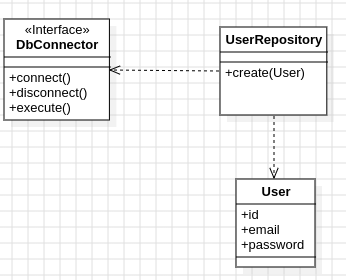

<h1>
    
    DESIGN PATTERN: SINGLETON
</h1>

This repository is dedicated to exploring and analyzing the Singleton design pattern, a creational design pattern widely used in software engineering.

<h2>
    
    About project
</h2>

<p>For the design pattern case study, a project created in Java was used, which replicates an example of a database connection class.</p>

<p>In this context, there are 2 components. The DbConnector class(SINGLETON), which interfaces with the external driver, and the system's repository class, which defines which query is executed.<p>

<h2>
    
    Class diagram
</h2>

<p align="center">
 
</p>

# Project structure

```
- 📁 src
  - 📁 main
    - 📁 java
      - 📁 com
        - 📁 example
        - 📁 entities
          - 📄 User.java
        - 📁 repository
          - 📄 UserRepository.js
        - 📁 utils
          - 📁 database
            - 📄 DbConnector.java
            - 📄 DbConnectorImpl.java
        - 📁 resources
  - 📁 test
    - 📁 java
      - 📁 repository
          - 📄 UserRepositoryTest.java
      - 📁 utils
        - 📁 database
          - 📄 DbConnectoImplTest.java

```
